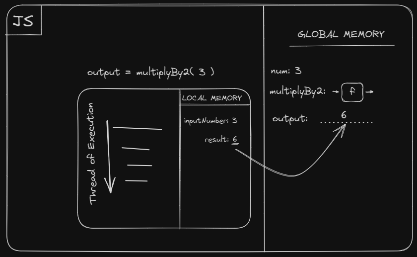
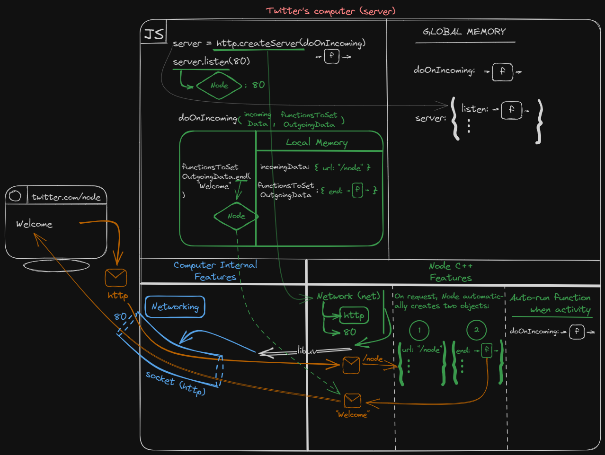

## These are my notes for the course The Hard Parts of Servers & Node.js by Will Sentance. If you want any of this to make any sense, go whatch the course on frontendmasters.com.
<br>


<details>
<summary>Introduction</summary>
<br>

## Executing JavaScript Code (Review)
<br>

### The two things JS does by itself - saving and using (executing) data
<br>

```javascript
let num = 3;
// 1. Save a function (code to run, parameters awaiting inputs)
function multiplyBy2(inputNumber) {
    const result = inputNumber * 2;
    return result;
}

// 2a. Call/run/invoke/execute a function (with parens)
// 2b. Insert an input (argument)
const output = multiplyBy2(num);
const newOutput = multiplyBy2(10);
```




### What else can JavaScript do?
Provide *labels* that trigger **Node** features.

E.g. We can set up, with a JavaScript label, a Node.js feature (that through C++ can access computer internals) to wait for requests for html/css/js/tweets etc. from our users. This feature is called **http**.

<br>
</details>

<details>
<summary>Using Node APIs</summary>
<br>

## Calling Node with JavaScript


### Using http feature of Node to set up an open socket
```javascript
const server = http.createServer();
server.listen(80);
```

We create an **http socket** that *listens* for any requests on port 80.
<br>

### Node auto-runs the code (function) *for us* when a request arrives from a user

```javascript
function doOnIncoming(incomingData, functionsToSetOutgoingData) {
    functionsToSetOutgoingData.end("Welcome to Twitter!");
}

const server = http.createServer(doOnIncoming);
server.listen(80);
```
1. We don't know when the inbound request would come - we have to rely on Node to trigger JS code to run.
2. JavaScript is single-threaded & synchronous. All slow work (e.g. speaking to a database) is done by Node in the background.

### Two parts to calling a function - executing its code and inserting input (arguments)

In *multiplyBy2(3)* the argument is **3** and we, the developer inserted it.

Node not only will auto-run our function at the right moment, it will also automatically insert whatever relevant data as the argument (input).


<br>
</details>